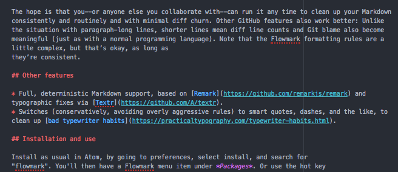
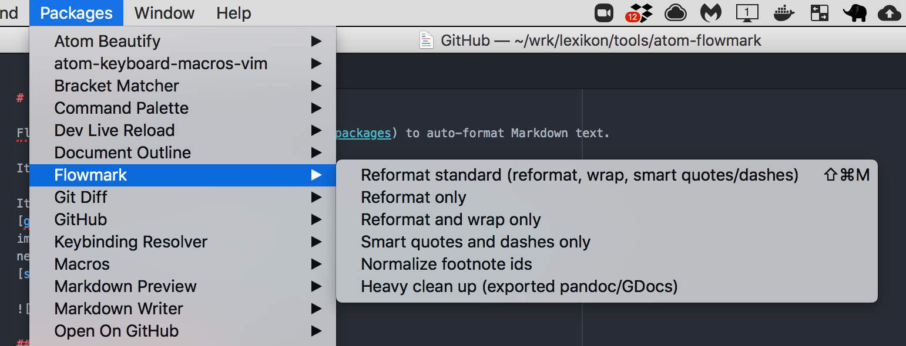

# atom-flowmark

Flowmark is an [Atom plugin](https://atom.io/packages) to auto-format Markdown text.

It aims to intelligently wrap lines for ease of reading and collaboration.

It draws inspiration from auto-formatting as pioneered by
[gofmt](https://utcc.utoronto.ca/~cks/space/blog/programming/GoWhyGofmtAccepted), previous
implementations like [markdownfmt](https://github.com/shurcooL/markdownfmt), and does some
new things regarding line wrappinig, like
[semantic linefeeds](http://rhodesmill.org/brandon/2012/one-sentence-per-line/).

## Why auto-format Markdown?

Auto-formatting is known to be a Very Good Thing when multiple programmers work together.
But it turns out the same idea can be hard to apply for Markdown, for subtle reasons
mostly related to the handling of paragraphs of text.

Existing auto-formatters standardize the common annoyances of inconsistent indentation,
different heading styles, and the like.

## Why also wrap lines?

The real challenge of collaborative editing in Markdown (and I’ve seen this a lot with
projects like [TAOCL](https://github.com/jlevy/the-art-of-command-line)) is **confusing diffs**
and **merge conflicts** common with multiple people editing paragraph-long lines on large,
GitHub-hosted Markdown files.

Flowmark tries a different approach:
It intelligently breaks lines on sentence boundaries when they are reasonable, while still
preserving the way the Markdown will render.
This may seem like an odd idea at first, but is a solution to two goals:

- Keeping all lines reasonably short, which aligns better with traditional Git and GitHub
  workflows and tools.
- Avoiding reflowing text gratuitously.
  It does not auto-wrap text on whole paragraphs every time there is a small change.
  Basically it “stabilizes” the line wrapping, so small changes—say only a few words in one
  sentence—only impact nearby lines in the file.

It also wraps links with long URLs in them intelligently, so they don’t bungle up your
paragraphs. Take a look at
[the source to this README](https://github.com/jlevy/atom-flowmark/blame/master/README.md) for
an example. (And see [this discussion](https://github.com/shurcooL/markdownfmt/issues/17) for
more details.)

The hope is that you—or anyone else you collaborate with—can run it any time to clean up
your Markdown consistently and routinely and with minimal diff churn.
Other GitHub features also work better:
Unlike the situation with paragraph-long lines, shorter lines mean diff line counts and
Git blame also become meaningful (just as with a normal programming language).
Note that the Flowmark formatting rules are a little complex, but that’s okay, as long as
they’re consistent.

## Flowmark features

- **Full markdown support:**
  Full, deterministic auto-formatting of Markdown, based on
  [Remark](https://github.com/remarkjs/remark), and wrapping lines based on practical
  heuristics.
- **Typographic cleanups:**
  Switches (conservatively, avoiding overly aggressive rules) to smart quotes, dashes, and
  the like, to clean up
  [bad typewriter habits](https://practicaltypography.com/typewriter-habits.html). (based on
  [Textr](https://github.com/A/textr)).(<https://pandoc.org/>).
- **Footnote normalization:**
  A new menu “normalize footnotes” menu option to rewrite footnotes so they have unique,
  deterministic ids based on their contents.
  Usually footnotes are numbered (`[^1]`, `[^2]`, etc.)
  but this is problematic if you ever try to merge Markdown documents.
  This option makes that simple and easy if you run it before merging docs!
  footnotes!
- **Fixes common formatting errors:**
  Has some optional “heavy cleanup” menu items that clean up common problems in Markdown,
  such as when docs are converted to Markdown using [Pandoc](https://pandoc.org/).

## Installation and use

Install as usual in Atom, by going to preferences, select install, and search for
“flowmark”. You’ll then have a Flowmark menu item under *Packages*. Or use the hot key
Shift-Cmd-M to reformat the whole doc.

It helps to use [line-diff-details-plus](https://atom.io/packages/line-diff-details-plus),
[GitHub Desktop](https://desktop.github.com/), or something similar to see and review changes
before saving or committing.

## Alternatives and previous work

Auto-formatting Markdown has been done before, notably with
[tidy-markdown](https://github.com/slang800/tidy-markdown) and
[atom-tidy-markdown](https://github.com/slang800/atom-tidy-markdown) (also used in
[atom-beautify](https://github.com/Glavin001/atom-beautify)),
[markdownfmt](https://github.com/shurcooL/markdownfmt) (in Go), and
[atom-markdown-format](https://github.com/shurcooL-legacy/atom-markdown-format) (an Atom
plugin based on markdownfmt but now deprecated).
These don’t try to reflow text, however.
A related approach, just to detect errors, is
[linter-markdown](https://github.com/AtomLinter/linter-markdown), which uses
[remark-lint](https://github.com/remarkjs/remark-lint)’s framework in Atom.

## Contributing

Yes, please! We use this heavily at [Holloway](https://www.holloway.com/) but I don’t have
much time to maintain it.
Note tests are handled manually by running on the `tests/testdoc.*.md` documents.
