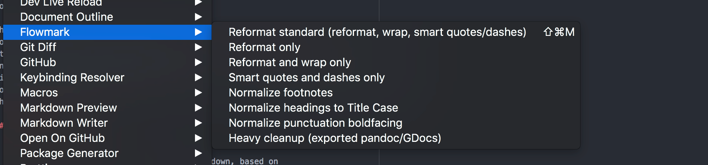

# Atom-Flowmark

Flowmark is an [Atom plugin](https://atom.io/packages) to auto-format Markdown source.

It draws inspiration from auto-formatting as pioneered by
[gofmt](https://utcc.utoronto.ca/~cks/space/blog/programming/GoWhyGofmtAccepted) and previous
implementations like [markdownfmt](https://github.com/shurcooL/markdownfmt), but also does
some helpful new things related to wrapping lines for ease of reading and collaboration
and cleaning up punctuation.
It also has some optional tools like cleaning up common Markdown problems and
“normalizing” footnotes.

## Why Auto-Format Markdown?

Auto-formatting is known to be a Very Good Thing when multiple programmers work together.
But it turns out the same idea can be hard to apply for Markdown, for subtle reasons
mostly related to the handling of paragraphs of text.

Existing auto-formatters standardize the common annoyances of inconsistent indentation,
different heading styles, and the like.

## Flowmark Features

- **Full markdown support:**
  Full, deterministic auto-formatting of Markdown, based on
  [Remark](https://github.com/remarkjs/remark), and wrapping lines based on practical
  heuristics. This includes [YAML front-matter](https://jekyllrb.com/docs/front-matter/),
  tables, and [footnotes](https://www.markdownguide.org/extended-syntax/#footnotes).
- **Typographic cleanups:**
  Converts ASCII quotes to smart quotes, dashes, and ellipses, to clean up
  [bad typewriter habits](https://practicaltypography.com/typewriter-habits.html) (based on
  [Textr](https://github.com/A/textr)). This is done conservatively, avoiding over-aggressive
  rules.
- **Heading normalization:**
  Rewrites all headings to Title Case, to avoid inconsistent capitalization.
- **Footnote normalization:**
  A “normalize footnotes” menu option to rewrite footnotes so they have unique,
  deterministic ids based on their contents.
  Usually footnotes are numbered (`[^1]`, `[^2]`, etc.)
  but this is problematic if you ever try to combine multiple Markdown documents into one.
  This option makes that simple and easy if you run it before merging docs!
- **Fixes other formatting errors:**
  This includes menu options that allow:
  - Normalize punctuation boldfacing to make trailing terminating punctuation (any of the
    characters `.:?!`) boldface when following boldface text.
    This is common typographic practice but often done inconsistently.
  - “Heavy cleanup” cleans up common problems in Markdown, such as when docs are converted to
    Markdown using [Pandoc](https://pandoc.org/).

## Why Also Auto-Wrap Lines in Markdown?

The real challenge of collaborative editing in Markdown (and I’ve seen this a lot with
projects of my own, like [TAOCL](https://github.com/jlevy/the-art-of-command-line)) is
**confusing diffs** and **merge conflicts**. These are common and frustrating when multiple
people edit paragraph-long lines on large, GitHub-hosted Markdown files.

Flowmark tries a different approach:
It intelligently breaks lines at “reasonable” places, usually on sentence boundaries,
while still preserving the way the Markdown will render.
This may seem like an odd idea at first, but is a solution to two (seemingly conflicting)
goals:

1. Keeping all lines reasonably short, which aligns better with traditional Git and GitHub
   workflows and tools.
2. Avoiding reflowing text gratuitously.
   It does not auto-wrap text on whole paragraphs every time there is a small change.
   Basically it “stabilizes” the line wrapping, so small changes—say only a few words in one
   sentence—only impact nearby lines in the file.

It also wraps links with long URLs in them intelligently, so they don’t bungle up your
paragraphs. Take a look at
[the source to this README](https://github.com/jlevy/atom-flowmark/blame/master/README.md) for
an example. (And see [this discussion](https://github.com/shurcooL/markdownfmt/issues/17) for
more details.)

The hope is that you—or anyone else you collaborate with—can run it any time to clean up
your Markdown consistently and routinely and with minimal diff churn.
Other GitHub features also work better:
Unlike the situation with paragraph-long lines, shorter lines mean diff line counts and
Git blame also become meaningful (just as with a normal programming language).
Note that the Flowmark formatting rules are a little complex, but that’s okay, as long as
they’re consistent.

## Installation and Use

Install as usual in Atom, by going to preferences, select install, and search for
“flowmark”. You’ll then have a Flowmark menu item under *Packages*. Or use the hot key
Shift-Cmd-M to reformat the whole doc.

It helps to use [line-diff-details-plus](https://atom.io/packages/line-diff-details-plus),
[GitHub Desktop](https://desktop.github.com/), or something similar to see and review changes
before saving or committing.

## Alternatives and Previous Work

The idea of wrapping text based on sentences or phrases from the idea of
[semantic linefeeds](http://rhodesmill.org/brandon/2012/one-sentence-per-line/).
Auto-formatting Markdown has been done before, notably with
[tidy-markdown](https://github.com/slang800/tidy-markdown) and
[atom-tidy-markdown](https://github.com/slang800/atom-tidy-markdown) (also used in
[atom-beautify](https://github.com/Glavin001/atom-beautify)),
[markdownfmt](https://github.com/shurcooL/markdownfmt) (in Go), and
[atom-markdown-format](https://github.com/shurcooL-legacy/atom-markdown-format) (an Atom
plugin based on markdownfmt but now deprecated).
These don’t try to reflow text, however.
A related approach, just to detect errors, is
[linter-markdown](https://github.com/AtomLinter/linter-markdown), which uses
[remark-lint](https://github.com/remarkjs/remark-lint)’s framework in Atom.

## Contributing

Yes, please! We use this heavily at [Holloway](https://www.holloway.com/) but I don’t have
much time to maintain it.
Note tests are handled manually by running on the `tests/testdoc.*.md` documents.
